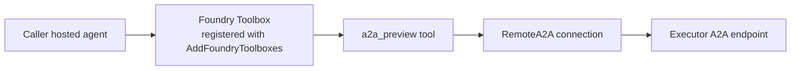

# A2A delegation (.NET)

A walkthrough for the [Agent-to-Agent (A2A) protocol](https://a2a-protocol.org/latest/) on Foundry, where **both** agents are Foundry-hosted [Agent Framework](https://github.com/microsoft/agent-framework) agents using the Responses protocol:

| Agent | Role | Folder |
|---|---|---|
| **Executor** — math expert | Hosted Responses agent exposed as an A2A endpoint via Foundry's [incoming A2A](https://learn.microsoft.com/en-us/azure/foundry/agents/how-to/enable-agent-to-agent-endpoint) feature. | [`executor/`](executor/) |
| **Caller** — concierge | Hosted Responses agent that delegates user questions to the executor through a Foundry **Toolbox** with an A2A connection. | [`caller/`](caller/) |

The caller sees the executor purely as an A2A skill discovered from the executor's [agent card](https://a2a-protocol.org/latest/#agent-card). The `RemoteA2A` connection uses `authType: UserEntraToken`, so the toolbox forwards the **calling user's** Microsoft Entra token to the executor's agent card endpoint.



## Layout

```text
01-delegation/
├── caller/         # Concierge hosted agent that delegates over A2A
└── executor/       # Math-expert hosted agent (gets exposed as A2A)
    └── src/agent-framework-a2a-executor-responses-dotnet/scripts/
        └── setup-a2a.{sh,ps1}    # Enables incoming A2A on the executor
```

## Prerequisites

- Standard hosted-agent prerequisites: a Foundry project, a model deployment, `azd` with the AI agent extension, and `az login`.
- [.NET 10 SDK](https://dotnet.microsoft.com/download/dotnet/10.0) or later.
- Azure CLI signed in as a principal with the **Foundry User** role (or higher) on the Foundry project.
- **Bash** (Linux/macOS/WSL) **or** **PowerShell** (Windows/macOS/Linux) to run [`setup-a2a`](executor/src/agent-framework-a2a-executor-responses-dotnet/scripts/).

## Walkthrough

The two agents are set up in separate `azd` projects. Four steps:

| # | What | Where |
|---|---|---|
| 1 | Deploy the **executor** | `hosted-agent-a2a-executor-dotnet/` |
| 2 | Run `setup-a2a` to enable incoming A2A on the executor (PATCH only) | `src/agent-framework-a2a-executor-responses-dotnet/scripts/setup-a2a.{sh,ps1}` |
| 3 | Deploy the **caller** — `azd provision` creates the `RemoteA2A` connection + `a2a_preview` toolbox from the manifest | `hosted-agent-a2a-caller-dotnet/` |
| 4 | Invoke the caller and watch it delegate | `azd ai agent invoke` |

> Commands below are Bash. PowerShell equivalents (`.ps1`) use the same defaults; pass `-ParamName` to override.

### 1. Deploy the executor

```bash
mkdir hosted-agent-a2a-executor-dotnet && cd hosted-agent-a2a-executor-dotnet

azd ai agent init --deploy-mode container -m https://github.com/microsoft-foundry/foundry-samples/blob/main/samples/csharp/hosted-agents/agent-framework/a2a/01-delegation/executor/azure.yaml

azd provision    # writes .env (FOUNDRY_PROJECT_ENDPOINT, AZURE_AI_MODEL_DEPLOYMENT_NAME)
azd deploy
```

Default agent name: `agent-framework-a2a-executor-responses-dotnet` (from the manifest).

### 2. Enable incoming A2A on the executor

```bash
./src/agent-framework-a2a-executor-responses-dotnet/scripts/setup-a2a.sh
```

This PATCHes the executor to publish its `agent_card` and add `a2a` to `agent_endpoint.protocols`. After that, the agent answers both Responses and A2A requests at the same endpoint. The PATCH is the only step that has to happen out-of-band — `agent_card` and multi-protocol endpoints aren't AgentSchema concepts, so the manifest can't express them yet.

On success the script prints the executor's A2A endpoint URL — **copy it**, you'll paste it into the caller prompt in the next step.

> The `RemoteA2A` connection and `a2a_preview` toolbox are **not** created here — they're declared in the caller's `azure.yaml` and created by `azd provision` on the caller (step 3).

### 3. Deploy the caller

```bash
mkdir ../hosted-agent-a2a-caller-dotnet && cd ../hosted-agent-a2a-caller-dotnet

azd ai agent init --deploy-mode container -m https://github.com/microsoft-foundry/foundry-samples/blob/main/samples/csharp/hosted-agents/agent-framework/a2a/01-delegation/caller/azure.yaml
# Paste the A2A endpoint URL from step 2 when prompted for `a2a_executor_endpoint`.

azd provision    # creates the RemoteA2A connection + a2a_preview toolbox from the manifest
azd deploy
```

The caller's manifest declares a `kind: connection` (`RemoteA2A` / `UserEntraToken`) pointing at the A2A endpoint, and a `kind: toolbox` with one `a2a_preview` tool. `azd provision` creates both — there's nothing to wire by hand. At startup the caller registers the toolbox by name (`TOOLBOX_NAME=a2a-delegation-tools`) with `AddFoundryToolboxes`; the hosting layer discovers its tools and injects them into every request as server-side tools, and the underlying connection is resolved on the server side.

### 4. Invoke the caller

```bash
azd ai agent invoke "What is 15 multiplied by 23?"
```

The caller delegates over A2A and returns a friendly summary. Other prompts to try:

- `"Compute the area of a circle with radius 7."`
- `"What is 2 to the power of 10, and is the result prime?"`

The executor still answers Responses requests directly — `azd ai agent invoke "What is 12 + 7?"` from the executor's project.

## Cleaning up

- `azd down` from each project (caller first, then executor). The caller's `azd down` removes the `RemoteA2A` connection and the `a2a_preview` toolbox along with the agent (they were provisioned by `azd` from the manifest).
- To revoke incoming A2A without deleting the executor agent, PATCH it with `agent_endpoint.protocols` set to `["responses"]` only.

## Reference

- [Enable incoming A2A on a Foundry agent](https://learn.microsoft.com/en-us/azure/foundry/agents/how-to/enable-agent-to-agent-endpoint) — covers the executor PATCH and the underlying REST contract for the connection.
- [Curate intent-based toolbox in Foundry](https://learn.microsoft.com/en-us/azure/foundry/agents/how-to/tools/toolbox?pivots=rest-api) — Toolbox REST API.
- [Connect to an A2A agent endpoint](https://learn.microsoft.com/en-us/azure/foundry/agents/how-to/tools/agent-to-agent) — caller side.
- [A2A toolbox scenario guide](../../../../../python/hosted-agents/SUPPORTED_TOOLBOX_SCENARIOS/tools/a2a.md) — workflow based on the Python A2A delegation sample.
