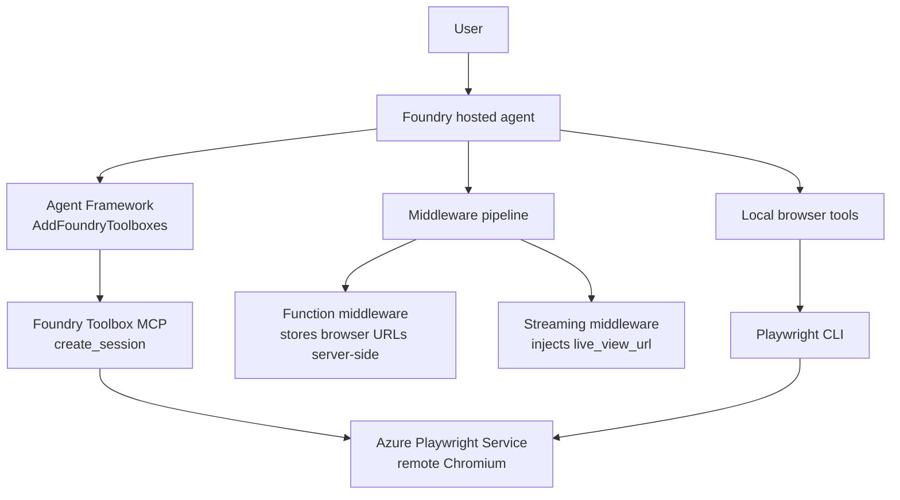

# What this sample demonstrates

An [Agent Framework](https://github.com/microsoft/agent-framework) hosted browser automation agent using **Foundry Toolbox** and the **Browser Automation tool** (Azure Playwright Service), hosted using the **Responses protocol**. The agent connects to a remote Chromium browser via Foundry Toolbox and runs Playwright CLI commands against it for general browsing, web scraping, and form filling.

## How It Works

### Solution Overview

When a user asks for browser work, the agent:

1. On startup, connects to a Foundry Toolbox MCP endpoint via `AddFoundryToolboxes` (automatic tool discovery).
2. The model calls `create_session` from the Toolbox to provision a remote Chromium browser via Azure Playwright Service.
3. Function invocation middleware intercepts the `create_session` result, stores the CDP URL and live view URL server-side (the model never sees the raw URLs).
4. Streaming middleware injects the live view URL into the SSE response so the user can watch the browser in real time.
5. Uses `run_playwright_cli` to invoke Playwright CLI commands against the remote browser.
6. Calls `close_browser_session` to detach Playwright CLI state and end the remote browser when done.



### Agent Hosting

The agent is hosted using the [Agent Framework](https://github.com/microsoft/agent-framework) with `AddFoundryResponses` and `AddFoundryToolboxes`, which provisions a REST API endpoint compatible with the OpenAI Responses protocol and automatically discovers toolbox tools via MCP.

### Prompt-Guided Behavior

The agent reads a single base prompt from `prompts/base.md`. That prompt contains the browser lifecycle, safety, web extraction, and form-filling guidance used at runtime.

See [Program.cs](src/browser-automation-csharp-maf-sample-foundry/Program.cs) for the full implementation.

## Repository layout

| Path | Purpose |
| --- | --- |
| `Program.cs` | Agent wiring — config, middleware pipeline, hosting setup. |
| `utils/Middlewares.cs` | Function invocation middleware (logging + `create_session` interception) and streaming middleware (live view URL injection). |
| `utils/Tools.cs` | Tool factory methods (`run_playwright_cli`, `close_browser_session`, `get_live_view_url`) and URL storage accessors. |
| `utils/BrowserSession.cs` | Playwright CLI subprocess runner with redaction and logging. |
| `utils/ToolboxScopedCredential.cs` | Token credential wrapper that overrides the toolbox auth scope. |
| `prompts/base.md` | Browser lifecycle, safety, cleanup, web extraction, and form-filling rules. |
| `skills/azure-playwright-browser-automation/SKILL.md` | Playwright CLI operational reference for remote Azure Playwright Service sessions. |

## Prerequisites

- An Azure AI Foundry project with a deployed chat model (e.g., `gpt-4.1`).
- Azure CLI installed and authenticated (`az login`).
- Docker, if you want to build the container locally.
- .NET 10 SDK for local development.

> **Note:** You do not need a pre-existing Azure Playwright workspace if your identity can create
> `Microsoft.LoadTestService/playwrightWorkspaces` resources in the target resource group. In a
> restricted project, set `PLAYWRIGHT_SERVICE_RESOURCE_ID` to an existing workspace instead. The
> deployment hooks create the connection and toolbox, then assign runtime roles during
> `azd provision` and `azd deploy`. See [Deployment hooks](#deployment-hooks) below.

For hosted-agent setup, see [Deploy hosted agents with azd](https://learn.microsoft.com/en-us/azure/foundry/agents/quickstarts/quickstart-hosted-agent?pivots=azd).

## Configuration

This sample uses two kinds of configuration:

- **Runtime environment variables** are read by the C# agent process. Use these for local runs, or set them in the hosted agent environment when deploying.
- **`azd` provisioning parameters** are read by `azd provision` from the azd environment. Use these only when you want this sample to create the Playwright connection and toolbox for you.

### Runtime environment variables

For local development, copy `.env.example` to `.env` or set these values in your shell. The app loads `.env` when it starts.

```bash
export FOUNDRY_PROJECT_ENDPOINT="https://<account>.services.ai.azure.com/api/projects/<project>"
export AZURE_AI_MODEL_DEPLOYMENT_NAME="gpt-4.1"
```

Or in PowerShell:

```powershell
$env:FOUNDRY_PROJECT_ENDPOINT="https://<account>.services.ai.azure.com/api/projects/<project>"
$env:AZURE_AI_MODEL_DEPLOYMENT_NAME="gpt-4.1"
```

| Variable | Default | Purpose |
| --- | --- | --- |
| `FOUNDRY_PROJECT_ENDPOINT` | Required locally; provided by hosted agent runtime when deployed | Foundry project endpoint used for model and Toolbox MCP calls. |
| `AZURE_AI_MODEL_DEPLOYMENT_NAME` | Required | Model deployment name. For hosted deployment, this is set from the model deployment selected during `azd ai agent init`; for local runs, set it in your shell or `.env` file. |
| `TOOLBOX_NAME` | `browser-automation-tools` | Foundry Toolbox name provisioned by the `postprovision` hook. This is fixed and should not be changed. |
| `BROWSER_AGENT_PLAYWRIGHT_CLI_TIMEOUT_SECONDS` | `180` | Optional timeout for each Playwright CLI command. |
| `BROWSER_AGENT_MCP_TIMEOUT_SECONDS` | `120` | Optional timeout for Toolbox MCP calls. |

The Toolbox endpoint is resolved as `<FOUNDRY_PROJECT_ENDPOINT>/toolboxes/browser-automation-tools/mcp?api-version=v1` and authenticated with the hosted agent identity.

## Option 1: Azure Developer CLI (`azd`)

### Prerequisites

1. **Azure Developer CLI (`azd`)** — [Install azd](https://learn.microsoft.com/en-us/azure/developer/azure-developer-cli/install-azd)
2. Install the Foundry extension:

   ```bash
   azd ext install microsoft.foundry
   ```

3. Authenticate:

   ```bash
   azd auth login
   ```

### Initialize the agent project

No cloning required. Create a new folder and initialize from the manifest:

```bash
mkdir browser-automation-agent && cd browser-automation-agent
azd ai agent init --deploy-mode container -m https://github.com/microsoft-foundry/foundry-samples/blob/main/samples/csharp/hosted-agents/agent-framework/browser-automation/azure.yaml
```

> [!NOTE]
> **Linux/macOS:** After `azd ai agent init`, run `chmod +x hooks/*.sh` to make the hook scripts executable. `azd ai agent init` downloads files via the GitHub API, which does not preserve file permissions.

Follow the prompts to configure your Foundry project and model deployment. If you don't have an existing Foundry project, `azd ai agent init` will guide you through creating one.

### Provision Azure resources (if needed)

If you don't already have a Foundry project and model deployment, provision them:

```bash
azd provision
```

The `postprovision` hook runs interactively and handles Playwright workspace connection and toolbox creation automatically (see [Deployment hooks](#deployment-hooks) below).

### Run the agent locally

```bash
azd ai agent run
```

The agent host will start on `http://localhost:8088`.

### Invoke the local agent

In a separate terminal, send a browser-automation request:

```bash
azd ai agent invoke --local --new-session "Open https://example.com and report the page title."
azd ai agent invoke --local "Now take a screenshot of the page."
```

The second invoke reuses the saved session and browser context.

### Deploy to Foundry

Once the toolbox is set up (see [Provision Azure resources](#provision-azure-resources-if-needed) above), deploy to Microsoft Foundry:

```bash
azd deploy
```

> [!NOTE]
> This sample is supported in container deployments only. The container image installs Playwright CLI, which this browser automation sample needs at runtime.

For the full deployment guide, see [Deploy a hosted agent](https://learn.microsoft.com/en-us/azure/foundry/agents/how-to/deploy-hosted-agent).

### Invoke the deployed agent

```bash
azd ai agent invoke --new-session "Open https://example.com and report the page title."
```

## Option 2: VS Code (Foundry Toolkit)

### Prerequisites

1. **VS Code** with the **[Foundry Toolkit](https://marketplace.visualstudio.com/items?itemName=ms-windows-ai-studio.windows-ai-studio)** extension installed.
2. [C# Dev Kit](https://marketplace.visualstudio.com/items?itemName=ms-dotnettools.csdevkit) extension.
3. Command Palette (`Ctrl+Shift+P`) → **C#: Check Workspace Requirements** to confirm the toolchain is ready.

### Run and debug the agent

The agent shells out to the Playwright CLI, so install it once before running:

```bash
npm install -g @playwright/cli@latest
playwright-cli install --skills
```

Then press **F5** to start the agent. The agent starts and the **Agent Inspector** opens automatically. Chat with the agent in the Inspector.

### Or run manually, then open the Inspector

1. Set the runtime environment variables (see [Configuration](#configuration)) and sign in to Azure with the Azure CLI (`az login`).
2. Install dependencies and start the agent:

   ```bash
   dotnet restore browser-automation.csproj
   npm install -g @playwright/cli@latest
   playwright-cli install --skills
   dotnet run --project browser-automation.csproj
   ```

   The agent listens on `http://localhost:8088`.
3. Command Palette (`Ctrl+Shift+P`) → **Foundry Toolkit: Open Agent Inspector**, then send a message to test.

### Deploy to Foundry

Complete the toolbox setup in [Provision Azure resources](#provision-azure-resources-if-needed), then:

1. Open the Command Palette (`Ctrl+Shift+P`) and run **Foundry Toolkit: Deploy Hosted Agent**. The extension opens a **Deploy Hosted Agent** wizard and reads `agent.yaml` to auto-populate settings.
2. If prompted, complete **Foundry Project Setup** to select subscription and project.
3. On the **Basics** tab, choose **Container** deployment and confirm the agent name. Code deployment does not install the Playwright CLI runtime dependency.
4. On **Review + Deploy**, confirm runtime details, pick **CPU and Memory** size, and click **Deploy**.
5. After deployment, invoke the agent in the Agent Playground and stream live logs from the **Logs** tab.

## Deployment hooks

This sample uses `azd` hooks to automate Playwright workspace setup:

### `postprovision` — Connection & Toolbox setup

After `azd provision` completes, the `postprovision` hook runs interactively and:

1. **Prompts for a Playwright workspace** — provide an existing ARM resource ID, or leave empty to create a new one.
2. **Selects a region** (for new workspaces) — dynamically fetches available regions from the Azure RP.
3. **Selects an authentication type:**
   - **Project Managed Identity** (recommended) — the Foundry project's MSI authenticates to the workspace.
   - **Agent Identity** — the hosted agent's identity authenticates.
   - **API Key** (existing workspaces only, interactive mode only) — uses an access token you provide. Not supported in CI/non-interactive flows because the token must be entered interactively.
4. **Deploys a Bicep template** that creates the workspace (if new) and the Playwright project connection.
5. **Creates the `browser-automation-tools` toolbox** via the Foundry data-plane API and sets it as the default version.

### `postdeploy` — RBAC role assignment

After `azd deploy` completes, the `postdeploy` hook:

1. Determines the correct principal ID based on the configured auth type:
   - **Project Managed Identity** → project's system-assigned identity
   - **Agent Identity** → the deployed agent's instance identity
2. Assigns the **Playwright Workspace Contributor** role on the Playwright workspace.
3. Retries up to 3 times with a graceful warning if the assignment fails (e.g., due to Entra propagation delays).

> **Note:** API Key authentication does not require a role assignment.

#### Non-interactive / CI usage

For CI pipelines or `azd provision --no-prompt`, pre-set the required values so the hooks skip interactive prompts:

```bash
# Use an existing Playwright workspace
azd env set PLAYWRIGHT_SERVICE_RESOURCE_ID "/subscriptions/{sub}/resourceGroups/{rg}/providers/Microsoft.LoadTestService/playwrightWorkspaces/{name}"
azd env set PLAYWRIGHT_AUTH_TYPE "ProjectManagedIdentity"   # or AgenticIdentityToken

# Or create a new workspace (omit PLAYWRIGHT_SERVICE_RESOURCE_ID)
azd env set PLAYWRIGHT_REGION "eastus"
azd env set PLAYWRIGHT_AUTH_TYPE "ProjectManagedIdentity"
```

> **⚠️ Warning:** If neither `PLAYWRIGHT_SERVICE_RESOURCE_ID` nor `PLAYWRIGHT_REGION` is set:
> - **PowerShell (Windows):** prompts time out after 60 seconds and default to creating a new workspace in **eastus**.
> - **sh (Linux/macOS):** prompts will **wait indefinitely** for input, blocking the pipeline.
>
> Always pre-set at least one of these variables in CI to avoid surprises or hanging builds.

| Variable | Required | Description |
| --- | --- | --- |
| `PLAYWRIGHT_SERVICE_RESOURCE_ID` | No | ARM resource ID of an existing workspace. Omit to create a new one. |
| `PLAYWRIGHT_REGION` | When creating new | Region for the new workspace (e.g., `eastus`). Defaults to `eastus` if not set. |
| `PLAYWRIGHT_AUTH_TYPE` | No | `ProjectManagedIdentity` (default) or `AgenticIdentityToken`. `ApiKey` is interactive-only. |

Creating a workspace requires `Microsoft.LoadTestService/playwrightWorkspaces/write` in the target
resource group. If you do not have that permission, an existing workspace ID is required.

### Option 1: Let hooks provision everything (recommended)

Use this path for a fully automated setup. Just run:

```bash
azd provision   # Hook prompts for Playwright details, creates connection + toolbox
azd deploy      # Hook assigns RBAC to the identity
```

## Customize the sample

- Change prompt behavior in `prompts/base.md`.
- Add deeper procedural knowledge as skills under `skills/`.
- Add new tools in `utils/Tools.cs`.
- Modify middleware logic in `utils/Middlewares.cs`.

## Guidance

This sample is intended as a starting point, not a production-ready browser automation platform. Before using it in production, review authentication, network access, data handling, secret management, logging, browser permissions, and approval flows for state-changing actions.

The `run_playwright_cli` tool intentionally invokes only `playwright-cli` with a named session and optional `PLAYWRIGHT_MCP_CDP_ENDPOINT`; it does not expose general shell execution.

The default hosted container resources (`cpu: "0.25"`, `memory: "0.5Gi"`) are minimal. Increase them in `azure.yaml` for multi-step scraping, longer QA sessions, or data-heavy browser automation.

Useful references:

- [Hosted agents in Microsoft Foundry](https://learn.microsoft.com/en-us/azure/foundry/agents/concepts/hosted-agents)
- [Agent Framework overview](https://learn.microsoft.com/en-gb/agent-framework/overview/?pivots=programming-language-csharp)
- [Agent Framework skills](https://learn.microsoft.com/en-gb/agent-framework/agents/skills?pivots=programming-language-csharp)
- [Playwright CLI](https://github.com/microsoft/playwright-cli)
