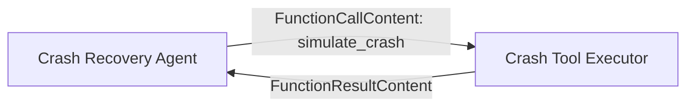

# What this sample demonstrates

This sample hosts a model-backed Agent Framework workflow with resilient background Responses
enabled. The workflow contains an Agent Executor with a declarative `simulate_crash` tool. When the
agent calls that tool, a second workflow executor intentionally terminates the process. AgentServer
starts a replacement process and Agent Framework resumes the same pending tool call from the durable
workflow checkpoint.

> [!WARNING]
> This sample deliberately terminates the agent process. Deploy it only to a development or test
> project.

## How it works



The agent receives an `AIFunctionDeclaration`. A declaration describes a tool to the model but has
no local implementation:

```csharp
AIFunctionDeclaration simulateCrash = AIFunctionFactory.CreateDeclaration(
    name: "simulate_crash",
    description: "Terminate the current agent process to demonstrate durable workflow recovery.",
    jsonSchema: JsonSerializer.SerializeToElement(new
    {
        type = "object",
        properties = new { },
        additionalProperties = false,
    }));
```

The Agent Executor intercepts the unterminated function call and sends it through the workflow:

```csharp
ExecutorBinding agentExecutor = crashAgent.BindAsExecutor(new AIAgentHostOptions
{
    InterceptUnterminatedFunctionCalls = true,
});
```

The agent uses a fixed `Id` and `Name`. A replacement process must reconstruct the same executor
identity for the persisted workflow checkpoint to remain compatible.

At the end of that workflow superstep, the Agent Executor checkpoints its agent session and the
pending `FunctionCallContent`. The Crash Tool Executor receives the call in the next superstep.

On the first execution, it waits five seconds so hosting can persist the completed Agent Executor
superstep, then calls `Environment.Exit(70)`. In the replacement process,
`OnCheckpointRestoredAsync` runs before the pending function call is delivered again. The executor
then returns a `FunctionResultContent` with the same call ID, and the Agent Executor continues the
original turn.

No marker file or external application state is used. Run each crash demonstration in a new session
and conversation so a checkpoint restoration unambiguously belongs to that interrupted turn.

Resilience is enabled when the Responses server is first registered:

```csharp
builder.Services.AddFoundryResponses(
    agent,
    configure: options => options.ResilientBackground = true);
```

Recovery applies only to stored background requests. Use `background=true` with `store=true`.

## Prerequisites

1. An existing Foundry project with a deployed model, or create them during Option 1.
2. [.NET 10 SDK](https://dotnet.microsoft.com/download/dotnet/10.0) or later.
3. The deployed agent identity needs the **Foundry User** role on the Foundry project so it can write
   durable workflow checkpoints.

## Option 1: Azure Developer CLI (`azd`)

### Prerequisites

1. [Azure Developer CLI (`azd`)](https://learn.microsoft.com/en-us/azure/developer/azure-developer-cli/install-azd) 1.27.1 or later.
2. Install the Foundry extension:

   ```bash
   azd ext install microsoft.foundry
   ```

3. Authenticate:

   ```bash
   azd auth login
   ```

### Initialize the agent project

```bash
mkdir resilient-workflow-agent && cd resilient-workflow-agent
azd ai agent init \
  -m https://github.com/microsoft-foundry/foundry-samples/blob/main/samples/csharp/hosted-agents/agent-framework/resilient-workflow/azure.yaml \
  --deploy-mode container
cd resilient-workflow
```

### Provision and run locally

```bash
azd provision
azd ai agent run
```

In another terminal, verify the non-destructive path:

```bash
azd ai agent invoke --local \
  "Reply briefly and include [LOCAL-READY]. Do not call any tools."
```

### Deploy

```bash
azd deploy
```

Assign the hosted agent identity the **Foundry User** role:

```bash
azd ai agent show resilient-workflow -o json
azd env get-value AZURE_AI_PROJECT_ID

az role assignment create \
  --assignee-object-id <instance_identity.principal_id> \
  --assignee-principal-type ServicePrincipal \
  --role "Foundry User" \
  --scope <AZURE_AI_PROJECT_ID>
```

Copy `instance_identity.principal_id` from the first command and the project resource ID from the
second command into the role-assignment command. Allow a few minutes for propagation. If the
workflow was invoked before assigning the role, redeploy so the hosted process does not continue
using a managed identity token acquired before the permission existed.

### Verify the deployed agent

```bash
azd ai agent invoke --new-session --new-conversation \
  "Reply briefly and include [DEPLOYED-READY]. Do not call any tools."
```

## Exercise crash recovery

Start a stored background response and return after `azd` receives its response ID:

```bash
azd ai agent invoke \
  --new-session \
  --new-conversation \
  --long-running \
  --no-wait \
  "Call simulate_crash to demonstrate crash recovery, then report the result."
```

The command saves the response ID as the current invocation and prints it under `Response`. Follow
that same stored response through process replacement:

```bash
azd ai agent invocations follow
```

`follow` replays persisted output and continues waiting while Foundry starts the replacement process.
If it exits with a transient timeout while the replacement process starts, run the same command
again. The response ID remains saved, so the next `follow` resumes the stored response. The final
response must explain that crash recovery succeeded.

## Option 2: VS Code (Foundry Toolkit)

Install the Foundry Toolkit and C# Dev Kit extensions. Press **F5** for normal prompts. Use the
`azd ai agent invoke --long-running --no-wait` and `azd ai agent invocations follow` commands above
for the crash demonstration.

For deployment, run **Foundry Toolkit: Deploy Hosted Agent**, select **Container**, deploy, and assign
the resulting agent identity the **Foundry User** role before invoking the workflow.

## Recovery and side effects

Workflow checkpoints, stored response events, and external side effects are not one transaction.
Recovery can repeat work after the last confirmed checkpoint. A real email, payment, queue
publication, or write API must accept an idempotency key so repeating a tool executor does not
repeat the business effect.

## Troubleshooting

**The response fails before the tool runs.** Assign **Foundry User** to the hosted agent managed
identity, wait for propagation, and redeploy if the agent was invoked before the role was assigned.

**The model does not call the tool.** Use the exact crash prompt from this README. The agent
instructions prohibit calling `simulate_crash` unless the user explicitly requests it.

**The process exits but the response never resumes.** Confirm the request used both
`background=true` and `store=true`, then keep polling the same response ID rather than submitting the
input again.

**A later crash request completes without terminating the process.** Start every demonstration with
a new session and conversation. `OnCheckpointRestoredAsync` indicates that the workflow instance was
restored from a checkpoint; this sample intentionally consumes that signal once.

**Recovery starts the wrong workflow shape.** Keep the workflow agent and executor IDs stable across
deployments. Changing them prevents persisted checkpoints from matching the reconstructed workflow.

**The CLI returns no visible assistant text.** Inspect the complete Responses event stream:

```bash
azd ai agent invoke --new-session --new-conversation --output raw \
  "Reply with [DIAGNOSTIC]. Do not call any tools."
```

Check the final `response.completed` or `response.failed` event. Friendly CLI output can be empty for
a failed response even when the command itself exits successfully.

## Next steps

- [Steering sample](../steering/)
- [Steerable workflow sample](../steerable-workflow/)
- [Hosted agents overview](https://learn.microsoft.com/en-us/azure/foundry/agents/concepts/hosted-agents)
