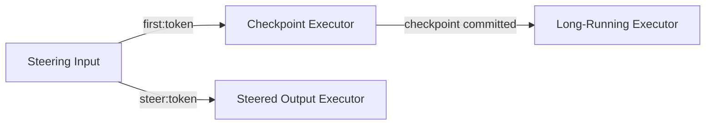

# What this sample demonstrates

This sample hosts a deterministic Agent Framework workflow with both resilient background execution
and steerable conversations enabled. It proves that a second input is queued while a workflow
superstep is active, the active superstep is cancelled, and the queued turn continues from the last
committed workflow checkpoint.

## How it works



The sample accepts three deterministic inputs:

| Input | Behavior |
| --- | --- |
| `echo:<token>` | Immediate smoke response: `ECHO-COMPLETE:<token>`. |
| `first:<token>` | Commits checkpoint 1, emits `CHECKPOINT-SAVED:1:<token>`, then enters a cancellable 30-second superstep. |
| `steer:<token>` | Reads the committed state and emits checkpoint number, session turn, and maximum observed concurrency. |

Both host-level options must be configured on the first `AddFoundryResponses` call:

```csharp
builder.Services.AddFoundryResponses(
    agent,
    configure: options =>
    {
        options.ResilientBackground = true;
        options.SteerableConversations = true;
    });
```

When steering arrives, AgentServer queues the second response and cancels the active handler. The
long-running superstep has not completed, so its partial work does not advance the workflow
checkpoint. Foundry Hosting saves the workflow session with the last committed checkpoint, then
AgentServer runs the queued input on that same session.

The successful steering response has this shape:

```text
STEERED-COMPLETE:<token>:CHECKPOINT-1:SESSION-TURN-2:MAX-CONCURRENCY-1
```

`MAX-CONCURRENCY-1` proves the cancelled superstep finished unwinding before the queued turn entered
its output executor.

## Prerequisites

1. An existing Foundry project. This sample does not require a model deployment.
2. [.NET 10 SDK](https://dotnet.microsoft.com/download/dotnet/10.0) or later.
3. The deployed agent identity needs the **Foundry User** role on the Foundry project so it can write
   durable workflow checkpoints.

## Option 1: Azure Developer CLI (`azd`)

### Prerequisites

1. [Azure Developer CLI (`azd`)](https://learn.microsoft.com/en-us/azure/developer/azure-developer-cli/install-azd) 1.27.1 or later.
2. Install the Foundry extension:

   ```bash
   azd ext install microsoft.foundry
   ```

3. Authenticate:

   ```bash
   azd auth login
   ```

### Initialize the agent project

```bash
mkdir steerable-workflow-agent && cd steerable-workflow-agent
azd ai agent init \
  -m https://github.com/microsoft-foundry/foundry-samples/blob/main/samples/csharp/hosted-agents/agent-framework/steerable-workflow/azure.yaml \
  --deploy-mode container
cd steerable-workflow
```

### Provision and run locally

```bash
azd provision
azd ai agent run
```

In another terminal:

```bash
azd ai agent invoke --local "echo:LOCAL-READY"
```

### Deploy

```bash
azd deploy
```

Assign the hosted agent identity the **Foundry User** role:

```bash
azd ai agent show steerable-workflow -o json
azd env get-value AZURE_AI_PROJECT_ID

az role assignment create \
  --assignee-object-id <instance_identity.principal_id> \
  --assignee-principal-type ServicePrincipal \
  --role "Foundry User" \
  --scope <AZURE_AI_PROJECT_ID>
```

Copy `instance_identity.principal_id` from the first command and the project resource ID from the
second command into the role-assignment command.

Allow a few minutes for role assignment propagation before invoking the workflow.

## Exercise workflow steering

Use two terminals from the initialized project directory. Pick one token and reuse it for every
command below.

Terminal 1:

```bash
azd ai agent invoke \
  --new-session \
  --new-conversation \
  "first:demo-001"
```

Terminal 1 prints the canonical conversation ID immediately:

```text
Conversation: conv_...
```

Copy that value. Wait about five seconds so the checkpoint executor can finish. While Terminal 1 is
still waiting, run in Terminal 2:

```bash
azd ai agent invoke \
  --conversation-id <conv_...> \
  "steer:demo-001"
```

AgentServer queues Terminal 2 and cancels the active handler. `azd` waits for the queued turn rather
than printing its intermediate `queued` state. Terminal 1 completes with:

```text
CHECKPOINT-SAVED:1:demo-001
```

Terminal 2 resumes pending work from checkpoint 1, then processes steering input:

```text
FIRST-NATURAL-COMPLETE:demo-001
STEERED-COMPLETE:demo-001:CHECKPOINT-1:SESSION-TURN-2:MAX-CONCURRENCY-1
```

Together, the two commands prove:

```text
First output contains: CHECKPOINT-SAVED:1:<token>
Queued turn replays: FIRST-NATURAL-COMPLETE:<token>
Steering output reads: CHECKPOINT-1
Steering output reads: SESSION-TURN-2
Steering output reads: MAX-CONCURRENCY-1
```

## Option 2: VS Code (Foundry Toolkit)

Install the Foundry Toolkit and C# Dev Kit extensions. Press **F5** for normal local requests. Use
the two `azd ai agent invoke` commands above for the steering demonstration.

For deployment, run **Foundry Toolkit: Deploy Hosted Agent**, select **Container**, deploy, and assign
the agent identity the **Foundry User** role before invoking the workflow.

## Troubleshooting

**The steering request is rejected as locked.** Confirm both requests use the same conversation ID
and the deployed code enables `SteerableConversations`.

**The first request completes naturally before steering is sent.** Increase
`LONG_RUNNING_DELAY_SECONDS` and redeploy.

**Checkpoint state is missing.** Assign **Foundry User** to the hosted agent identity and wait for the
role assignment to propagate.

**Maximum concurrency is 2.** The queued turn entered before the cancelled executor finished
unwinding. Inspect the workflow and hosting logs before relying on shared process resources.

## Next steps

- [Steering with a regular agent](../steering/)
- [Crash recovery with a workflow](../resilient-workflow/)
- [Hosted agents overview](https://learn.microsoft.com/en-us/azure/foundry/agents/concepts/hosted-agents)
