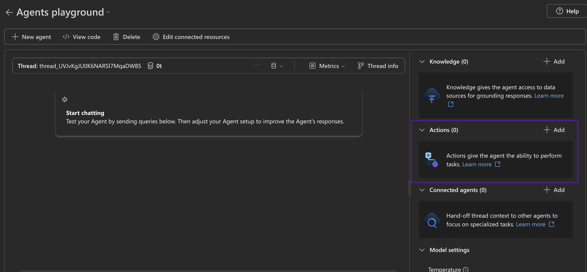
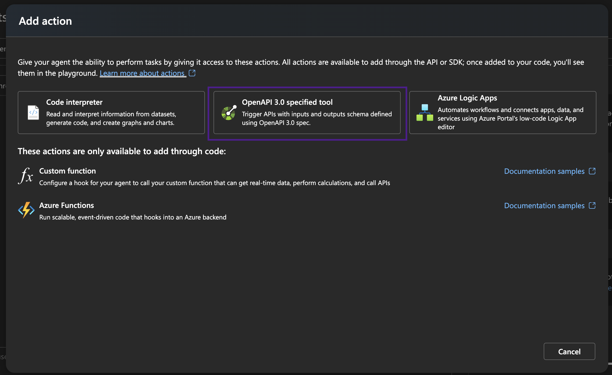

> [!IMPORTANT]
> Important Note From Microsoft:
> * Your use of connected non-Microsoft services is subject to the terms between you and the service provider. By connecting to a non-Microsoft service, you acknowledge that some of your data, such as prompt content, is passed to the non-Microsoft service, and/or your application might receive data from the non-Microsoft service. You are responsible for your use (and any charges associated with your use) of non-Microsoft services and data.
> * The code in this 3p-tools file were created by third parties, not Microsoft, and have not been tested or verified by Microsoft. Your use of the code samples is subject to the terms provided by the relevant third party. By using any third-party sample in this file, you are acknowledging that Microsoft has no responsibility to you or others with respect to these samples.

# Nimble

## Description

Nimble Web Agents automatically browses and navigate the web, grabs the important data, and hands you clear answers instead of a list of links. They:
* **Continuously navigate** the live web like a human researcher—navigating within sites, following links, and harvesting structured data at scale.
* **Normalize and enrich** HTML into clean JSON or SQL tables, ready for immediate analysis.
* **Orchestrate multi-step tasks** — from gathering hundreds of pages to validating, ranking, and summarizing insights.

Web Agents run live on the web for instant answers, and you can optionally layer an asynchronous background pipeline that crawls thousands of pages, extracts prices, reviews, events, and feeds that high-scale data back to the agent for even deeper insight—no manual clicks or cleanup needed.

## Prerequisites

- Register for an account at [Nimble's signup page](https://app.nimbleway.com/signup)
- Navigate to the "Pipelines" page and access the "Nimble API" pipeline
- Obtain your API credentials (provided as a base64 token)

## Setup
1. Go to [Azure AI Foundry portal](https://ai.azure.com/) and select your AI Project. Select **Management Center**.
   
   

2. Select **+new connection** in the settings page and select **custom keys** in **other resource types**.

   

4. Enter the following information to create a connection to store your Nimble credentials:
   1. Set **Custom keys** to "key", with the value being your Nimble API credentials in Basic Auth format (e.g., "Basic base64_encoded_username_password").
   2. Make sure **is secret** is checked.
   3. Set the connection name to your preferred name. You will use this connection name in your code or Foundry Portal later.
   4. For the **Access** setting, you can choose either *this project only* or *shared to all projects*. Just make sure in your code, the connection string of the project you entered has access to this connection.

   

## Use Nimble through the Foundry Portal

1. To use the Nimble tool in the Azure AI foundry, in the **Create and debug** screen for your agent, scroll down the **Setup** pane on the right to **Actions**. Then select **Add**.


2. Select **OpenAPI 3.0 specified tool**


3. Create the tool
    1. Give a name and a description for the tool that will help the model understand the functionality.

    2. Define the Schema. Make sure the authentication method is set to **Connection**. For **Choose a connection**, use the connection name of the connection you made [above](#add-your-api-key-to-azure-ai-foundry)

    3. Paste the OpenAPI schema [nimble.json](./nimble.json). 


4. Finish and start chatting.

## Connect Nimble through code-first experience

You can follow the [code sample](./nimble.py) to use Nimble through Agent SDK.

1. Remember to store and import Nimble [OpenAPI spec](./nimble.json).

2. Make sure you have updated the authentication method to be `connection` and fill in the connection ID of your custom key connection:
   ```python
   auth = OpenApiConnectionAuthDetails(security_scheme=OpenApiConnectionSecurityScheme(connection_id="your_connection_id"))
   ```

## Using Nimble Tools

The Nimble tool provides two main capabilities:

1. **Web Search** - Use the `nimbleDeepWebSearch` operation to search the web using different search engines:
   - Parameters:
     - `query`: The search query to execute
     - `search_engine`: The search engine to use (google_search, google_sge, bing_search, yandex_search)
     - `k`: Number of search results to return
     - `parsing_type`: The parsing type for content (plain_text, markdown, simplified_html)

2. **Maps Data** - Use the `googleMapsOperations` operation to retrieve maps data:
   - Parameters:
     - `search_engine`: The maps operation type (google_maps_search, google_maps_place, google_maps_reviews)
     - `query`: The search query (for google_maps_search)
     - `place_id`: The Google Maps place ID (for google_maps_place and google_maps_reviews)
     - `sort_by`: Sort method for reviews (relevance, newest, highest_rating)

## Customer Support Contact

For any issues with the Nimble APIs, please contact support@nimbleway.com or visit our [help center](https://docs.nimbleway.com).
