# Private Network Architecture

This document describes the private deployment selected when
`publicNetworkAccess` is `Disabled` in `infra/main.bicep`. It covers the Azure
resources, security boundaries, routing, DNS, and application data flows.

For deployment commands, VM creation, firewall DNAT, and agent publication, see
[Private Networking Deployment Guide](./private-networking-readme.md).

## Deployment modules

`infra/main.bicep` separates the public and private account paths:

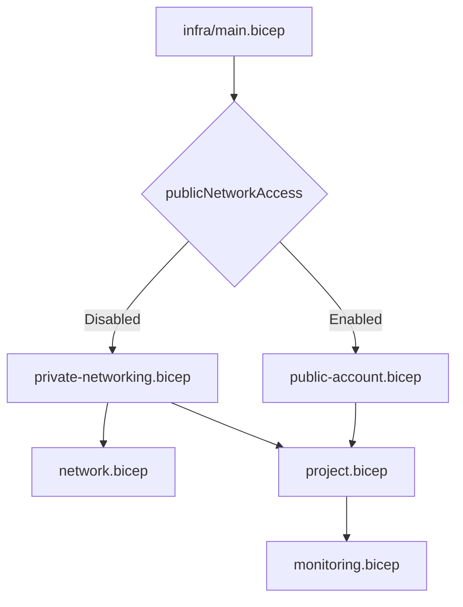

| Module | Responsibility |
|---|---|
| `infra/main.bicep` | Parameters, public/private selection, shared module orchestration, and `azd` outputs |
| `infra/modules/public-account.bicep` | Minimal Foundry account with public network access enabled |
| `infra/modules/private-networking.bicep` | Private Foundry account configuration, subnets, NSGs, private endpoint, private DNS, and network injection |
| `infra/modules/network.bicep` | Hub and spoke VNets, Azure Firewall, firewall policy, route table, and VNet peerings |
| `infra/modules/project.bicep` | Foundry project, model deployment, ACR, RBAC, Application Insights connection, and shared resources |
| `infra/modules/monitoring.bicep` | Log Analytics workspace and Application Insights |

The Foundry account is created in either the public or private module. The
shared project module treats that account as an existing parent resource. This
keeps private network properties out of the public account definition.

## Logical topology

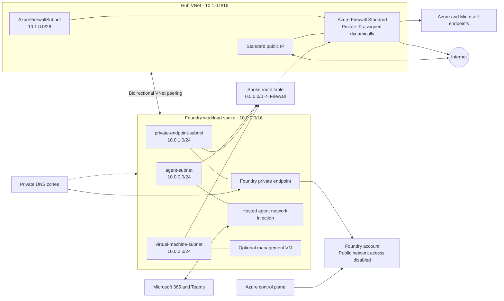

## Address plan

The defaults can be changed in `infra/main.bicep`. Address spaces must not
overlap with each other or with networks that will be connected later.

| Network | Default prefix | Purpose |
|---|---:|---|
| Hub VNet | `10.1.0.0/16` | Central network services and Azure Firewall |
| `AzureFirewallSubnet` | `10.1.0.0/26` | Required dedicated subnet for Azure Firewall |
| Workload spoke VNet | `10.0.0.0/16` | Foundry hosted-agent, private endpoint, and VM subnets |
| `agent-subnet` | `10.0.0.0/24` | Foundry hosted-agent network injection |
| `private-endpoint-subnet` | `10.0.1.0/24` | Foundry account private endpoint |
| `virtual-machine-subnet` | `10.0.2.0/24` | Optional management or test VMs |

## Hub and Azure Firewall

The hub contains only `AzureFirewallSubnet` in this sample. Azure Firewall
Standard has:

- A private IP used as the `VirtualAppliance` next hop for spoke UDRs.
- A Standard static public IP for outbound SNAT and optional DNAT.
- An Azure Firewall Policy with threat intelligence in `Alert` mode.
- Forwarded-traffic support on both VNet peerings.

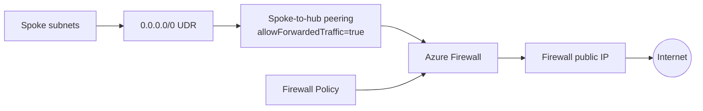

### Default firewall policy

| Collection | Rule | Protocol and port | Destination |
|---|---|---|---|
| `allow-required-network-traffic` | `allow-dns` | TCP/UDP 53 | Any |
| `allow-required-network-traffic` | `allow-ntp` | UDP 123 | Any |
| `allow-https-outbound` | `allow-https` | HTTPS 443 | Any FQDN |

The wildcard HTTPS rule is suitable for demonstrating centralized routing, but
it is not a least-privilege production policy. Replace it with approved FQDNs,
FQDN tags, service tags, or explicit network rules for the workload.

Azure Firewall Standard does not perform TLS inspection. It evaluates the
application rule and forwards the encrypted HTTPS session.

## Workload spoke

The spoke is peered directly with the hub. Peering is non-transitive; adding
another spoke does not automatically give that spoke connectivity to this one.
Each additional spoke requires its own hub peerings and route-table design.

### Hosted-agent subnet

`agent-subnet` is delegated to `Microsoft.App/environments` and is referenced
by the Foundry account's `networkInjections` property:

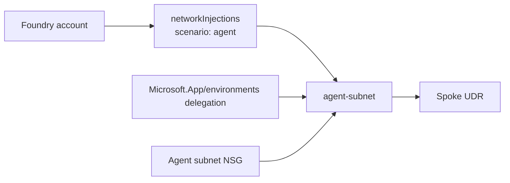

The agent NSG permits outbound traffic to:

- The virtual network, including private endpoints.
- Microsoft Entra ID over TCP 443.
- Azure Monitor over TCP 443.
- Azure Front Door Frontend over TCP 443.
- Microsoft Teams IPv4 ranges over TCP 443.

It then has an explicit outbound deny rule at priority `4096`. Both the NSG and
Azure Firewall policy must allow a flow.

> [!IMPORTANT]
> Foundry network injection is effectively immutable after it is set. Do not
> rename or replace `agent-subnet` for an existing account. Moving an existing
> account to another subnet can fail with
> `NetworkInjectionUpdateNotAllowed`.

### Private endpoint subnet

`private-endpoint-subnet` hosts the Foundry account private endpoint. Private
endpoint network policies are disabled as required by this configuration. The
route table is associated with the subnet, but Azure installs more-specific
`InterfaceEndpoint` routes for private endpoint addresses; those `/32` routes
take precedence over the `0.0.0.0/0` firewall route.

### VM subnet

`virtual-machine-subnet` is a non-delegated subnet for management and testing.
It has:

- A dedicated subnet NSG.
- Private endpoint network policies enabled.
- The spoke route table, forcing default egress through Azure Firewall.
- No inbound allow rules by default.

VMs should be created without direct public IPs. If RDP is required, use Azure
Bastion or an Azure Firewall DNAT rule restricted to a trusted source CIDR.

## Routing behavior

Every workload subnet is associated with the same route table:

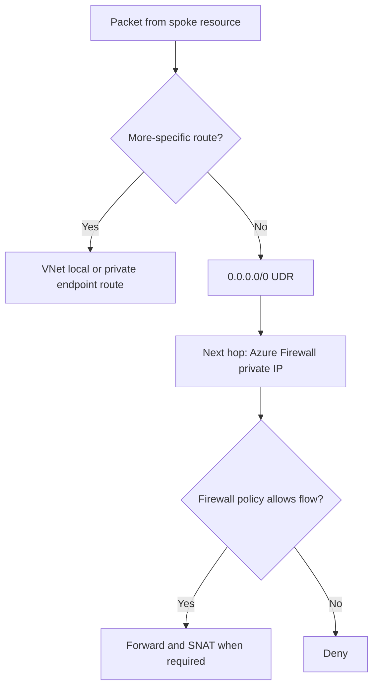

Azure uses longest-prefix matching. VNet-local routes and private endpoint `/32`
routes are more specific than `0.0.0.0/0`, so they do not traverse the firewall.
Internet-bound traffic follows the UDR to the firewall.

## Private endpoint and DNS

The private deployment creates and links these zones to the spoke:

- `privatelink.services.ai.azure.com`
- `privatelink.openai.azure.com`
- `privatelink.cognitiveservices.azure.com`

The private endpoint has a zone group containing all three zones.

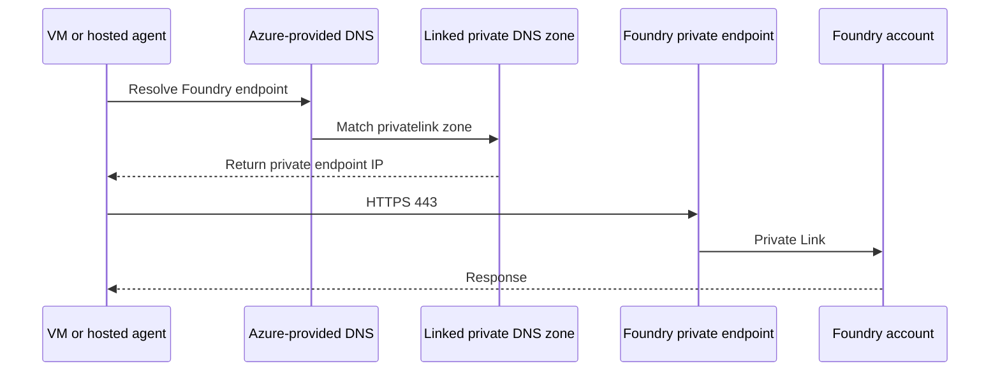

Clients must use DNS that can resolve the linked private zones. The default
Azure-provided resolver works for resources in the linked spoke. Custom DNS
requires conditional forwarding for the Azure private DNS namespace.

## Data flows

### Control-plane provisioning

The operator runs `azd provision`. Azure Resource Manager creates the network,
Foundry, project, model, registry, RBAC, and monitoring resources.

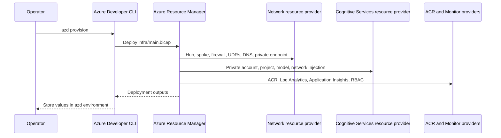

Azure control-plane requests are not sent through the workload firewall. They
originate from the operator and ARM deployment service.

### Hosted-agent egress

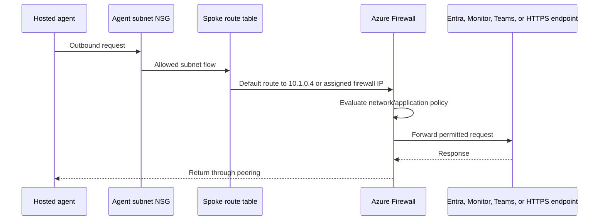

### VM egress

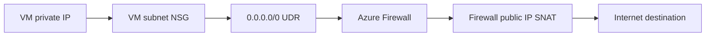

The VM does not require a public IP for outbound access.

### Optional VM ingress through firewall DNAT

DNAT is an operational step because the trusted source CIDR and VM private IP
are environment-specific. It is not created by the base Bicep modules.

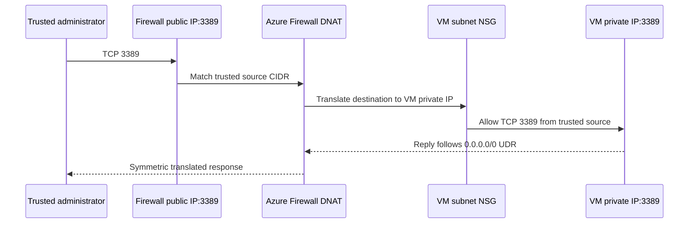

Do not attach a direct public IP to a VM that retains the forced-tunnel UDR.
Inbound traffic would arrive through the VM public IP while replies would leave
through Azure Firewall, causing asymmetric routing.

### Agent build, creation, and publication

The post-provision hook performs data-plane operations:

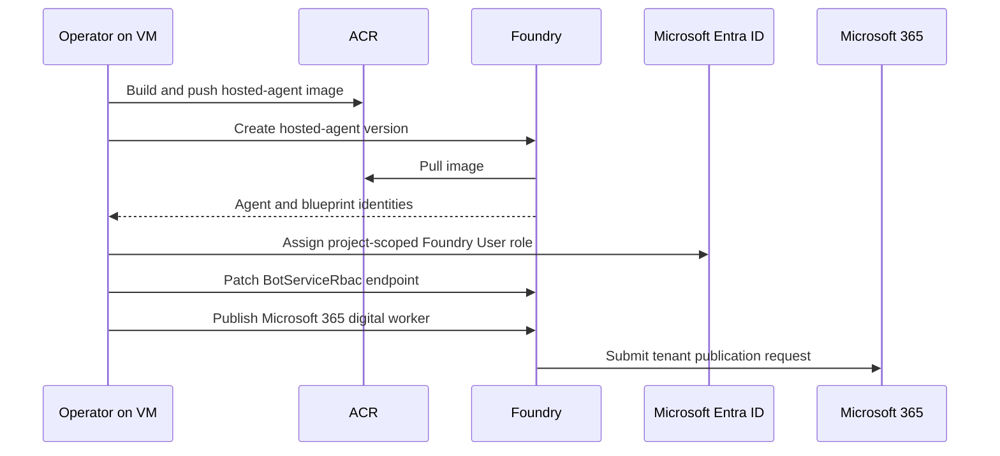

The Container Registry currently has public network access enabled. The Foundry
account is private, but this sample does not make ACR, Log Analytics, or
Application Insights private.

### Teams interaction

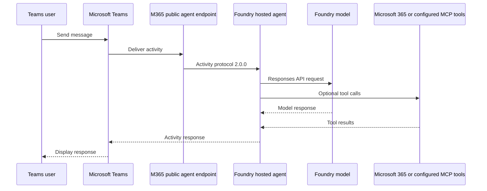

## Security boundaries and limitations

- The Foundry account has public network access disabled.
- The Foundry private endpoint is reachable from the linked spoke.
- Hosted-agent and VM default egress traverses Azure Firewall.
- NSGs and firewall policy are both enforced; allowing a flow in only one is
  insufficient.
- The VM subnet denies unsolicited inbound traffic unless an NSG rule is added.
- The default HTTPS firewall rule allows any FQDN and should be narrowed for
  production.
- ACR and monitoring endpoints are not private in this sample.
- Azure Firewall diagnostics are not currently declared by the Bicep modules.
  Configure diagnostic settings to send structured `AZFW*` logs to the sample's
  Log Analytics workspace when traffic auditing is required.
- Azure Firewall, public IP, Log Analytics ingestion, and VMs incur charges.

## Important outputs

After provisioning, `azd env get-values` includes:

| Output | Use |
|---|---|
| `VIRTUAL_NETWORK_ID` | Workload spoke resource ID |
| `HUB_VIRTUAL_NETWORK_ID` | Hub resource ID |
| `AZURE_FIREWALL_ID` | Azure Firewall resource ID |
| `AZURE_FIREWALL_PRIVATE_IP` | UDR next-hop address |
| `SPOKE_ROUTE_TABLE_ID` | Route table associated with workload subnets |
| `AGENT_SUBNET_ID` | Foundry network-injection subnet |
| `VIRTUAL_MACHINE_SUBNET_ID` | Subnet for optional VMs |
| `PRIVATE_ENDPOINT_ID` | Foundry account private endpoint |
| `AZURE_AI_PROJECT_ENDPOINT` | Foundry project data-plane endpoint |
