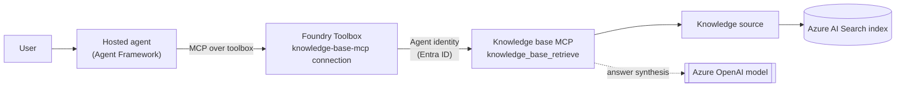

# Foundry IQ Knowledge Base Agent (Responses Protocol)

An [Agent Framework](https://github.com/microsoft/agent-framework) agent that answers questions from a **[Foundry IQ](https://learn.microsoft.com/azure/search/agentic-retrieval-concept) knowledge base** (Azure AI Search agentic retrieval), hosted on Microsoft Foundry using the **Responses protocol**. The agent reaches the knowledge base through a **Foundry Toolbox** that proxies the knowledge base's MCP endpoint.

## How it works



1. **Knowledge base (data plane).** [`provision_kb.py`](src/agent-framework-foundry-iq-knowledge-base-responses/provision_kb.py) creates an Azure AI Search index, seeds it with the "Earth at night" documents, and builds a **knowledge source** and a **knowledge base**. The knowledge base synthesizes answers with an Azure OpenAI model and exposes an MCP endpoint (`{search}/knowledgebases/{kb}/mcp`) whose only tool is `knowledge_base_retrieve`.
2. **Toolbox connection.** A `RemoteTool` **connection** (`knowledge-base-mcp`) authenticates to the knowledge base's MCP endpoint with **Agentic Identity** — the agent's managed identity, keyless. A **toolbox** (defined in [`toolbox.yaml`](src/agent-framework-foundry-iq-knowledge-base-responses/toolbox.yaml)) exposes that endpoint as an MCP tool: its `server_url` points at the knowledge base's MCP endpoint and `project_connection_id` supplies the connection's auth. Both are created for you by the `azd provision` `postprovision` hook (see [Provision and run the agent](#provision-and-run-the-agent)).
3. **Agent.** [`main.py`](src/agent-framework-foundry-iq-knowledge-base-responses/main.py) uses `FoundryChatClient` and connects to the toolbox's MCP endpoint with `FoundryToolbox`. The agent discovers `knowledge_base_retrieve` at runtime and grounds its answers in the retrieved sources.

### Model Integration

The agent uses `FoundryChatClient` from the Agent Framework to create an OpenAI-compatible Responses client, and connects to the toolbox over MCP via `FoundryToolbox`. It reads the toolbox's MCP endpoint from the `TOOLBOX_ENDPOINT` environment variable. See [main.py](src/agent-framework-foundry-iq-knowledge-base-responses/main.py) for the full implementation.

## Prerequisites

- An Azure AI Foundry project with a deployed chat model (e.g. `gpt-5.4-mini`).
- An **Azure AI Search** service ([create one](https://learn.microsoft.com/azure/search/search-create-service-portal)) with a **system-assigned managed identity** and **RBAC** enabled (Portal → search service → **Keys** → **API Access control** → "Both" or "Role-based access control").
- Azure CLI logged in (`az login`).

### Required RBAC

| Identity | Role | Scope | Why |
| --- | --- | --- | --- |
| Search service managed identity | **Cognitive Services User** | Foundry account | Knowledge base calls the Azure OpenAI model for answer synthesis (keyless) |
| You (provisioning) | **Search Service Contributor** | Search service | Create the index, knowledge source, and knowledge base |
| You (provisioning) | **Search Index Data Contributor** | Search service | Upload the seed documents |
| The agent's managed identity | **Search Index Data Reader** | Search service | The deployed agent retrieves from the knowledge base at query time |

> The agent's managed identity is created when you deploy the agent. Grant it **Search Index Data Reader** on the search service after the first `azd deploy` (see [Grant the agent access](#grant-the-agent-access-to-the-knowledge-base)).

## Provision and run the agent

### Option 1: Azure Developer CLI (`azd`)

With the bundled `postprovision` hook, a single `azd provision` builds the knowledge base, creates the toolbox connection and toolbox, and sets `TOOLBOX_ENDPOINT` for you.

#### 1. Install prerequisites

1. **Azure Developer CLI (`azd`)** — [Install azd](https://learn.microsoft.com/en-us/azure/developer/azure-developer-cli/install-azd) (1.25 or later)
2. Install the unified Foundry CLI extension bundle:
   ```bash
   azd ext install microsoft.foundry
   ```
3. Authenticate:
   ```bash
   azd auth login
   ```

#### 2. Initialize the agent project

No cloning required. Create a new folder and initialize from the manifest:

```bash
mkdir my-foundry-iq-agent && cd my-foundry-iq-agent

azd ai agent init -m https://github.com/microsoft-foundry/foundry-samples/blob/main/samples/python/hosted-agents/agent-framework/responses/17-foundry-iq-toolbox/azure.yaml
```

Follow the prompts to configure your Foundry project and model deployment. If you don't have an existing Foundry project, `azd ai agent init` will guide you through creating one. Initializing also sets the selected project as the active project, and copies this sample's files into a new service directory `src/<agent-name>/` — including [`provision_kb.py`](src/agent-framework-foundry-iq-knowledge-base-responses/provision_kb.py), [`toolbox.yaml`](src/agent-framework-foundry-iq-knowledge-base-responses/toolbox.yaml), and the [`hooks/`](hooks/) scripts.

#### 3. Enable one-command provisioning (`postprovision` hook)

Wire the bundled hook into the `azure.yaml` that `azd ai agent init` generated, so the knowledge base, connection, and toolbox are created automatically every time you run `azd provision`. `postprovision` must be registered at the **top level** of `azure.yaml` (service-scoped hooks only support the package/deploy lifecycle), and the `run:` path must point at the hook inside the generated service directory. Add this top-level block, replacing `<agent-name>` with the service folder `azd ai agent init` created under `src/`:

```yaml
hooks:
  postprovision:
    posix:
      shell: sh
      run: ./src/<agent-name>/hooks/postprovision.sh
    windows:
      shell: pwsh
      run: ./src/<agent-name>/hooks/postprovision.ps1
```

The hook ([`hooks/postprovision.sh`](hooks/postprovision.sh) / [`hooks/postprovision.ps1`](hooks/postprovision.ps1)) runs everything the [manual steps](#provision-manually-without-the-hook) below would, in one shot. It locates its own directory, so it works no matter where `azd` runs it from.

#### 4. Provision

Point the hook at your existing Azure AI Search service, then provision:

```bash
azd env set AZURE_SEARCH_ENDPOINT "https://<your-search>.search.windows.net"
azd provision
```

`azd provision` creates (or reuses) your Foundry project and model deployment, then the `postprovision` hook:

1. Runs [`provision_kb.py`](src/agent-framework-foundry-iq-knowledge-base-responses/provision_kb.py) to build the search index, knowledge source, and knowledge base, and stores the KB's MCP endpoint as `KB_MCP_ENDPOINT`.
2. Creates the `knowledge-base-mcp` `RemoteTool` connection (Agentic Identity, keyless) targeting that endpoint.
3. Creates the `knowledge-base` toolbox from [`toolbox.yaml`](src/agent-framework-foundry-iq-knowledge-base-responses/toolbox.yaml).
4. Sets `TOOLBOX_ENDPOINT` so the agent connects to the toolbox.

> The hook derives `AZURE_OPENAI_ENDPOINT` from your Foundry project endpoint for answer synthesis. To use a different Azure OpenAI resource, set it explicitly first: `azd env set AZURE_OPENAI_ENDPOINT "https://<account>.openai.azure.com"`.

#### 5. Run the agent locally

```bash
azd ai agent run
```

The agent host will start on `http://localhost:8088`.

#### Invoke the local agent

In a separate terminal, from the project directory:

```bash
azd ai agent invoke --local "What can you tell me about the Earth at night?"
```

#### Deploy to Foundry

```bash
azd deploy
```

For the full deployment guide, see [Deploy a hosted agent](https://learn.microsoft.com/en-us/azure/foundry/agents/how-to/deploy-hosted-agent).

#### Grant the agent access to the knowledge base

After the first deploy, grant the agent's managed identity **Search Index Data Reader** on the search service so it can retrieve at query time:

```powershell
$searchId = az search service show -n <search-name> -g <rg> --query id -o tsv
# Find the agent identity object id in the Foundry portal (Agents → your agent → Identity),
# or via the deployment output, then:
az role assignment create --assignee-object-id <agent-identity-object-id> --assignee-principal-type ServicePrincipal `
  --role "Search Index Data Reader" --scope $searchId
```

#### Invoke the deployed agent

```bash
azd ai agent invoke "What can you tell me about the Earth at night?"
```

#### Provision manually (without the hook)

Prefer to run the steps yourself (or skip the hook)? Provision the knowledge base directly from the project directory, with `az login` done:

```bash
export AZURE_SEARCH_ENDPOINT="https://<your-search>.search.windows.net"
export AZURE_OPENAI_ENDPOINT="https://<account>.openai.azure.com"
export AZURE_AI_MODEL_DEPLOYMENT_NAME="gpt-5.4-mini"
uv run --frozen --group provisioning python provision_kb.py
```

In PowerShell, use `$env:NAME="value"` instead of `export`. The script prints the knowledge base's **MCP endpoint** and is safe to re-run. Then create the connection, point the toolbox's `server_url` at that endpoint, create the toolbox, and store the toolbox endpoint:

```bash
azd ai connection create knowledge-base-mcp --kind remote-tool \
  --target "<kb-mcp-endpoint>" \
  --auth-type agentic-identity --audience https://search.azure.com --metadata "ApiType=Azure"

# toolbox.yaml uses ${KB_MCP_ENDPOINT} for the tool's server_url — replace it with
# the endpoint provision_kb.py printed (or export KB_MCP_ENDPOINT and envsubst it).
azd ai toolbox create knowledge-base --from-file ./toolbox.yaml

azd env set TOOLBOX_ENDPOINT "https://<account>.services.ai.azure.com/api/projects/<project>/toolboxes/knowledge-base/mcp?api-version=v1"
```

## Option 2: VS Code (Foundry Toolkit)

> The VS Code flow doesn't run the `azd` hook — provision the knowledge base, connection, and toolbox first with [Provision manually](#provision-manually-without-the-hook).

1. Open the sample folder in VS Code (after `azd ai agent init` from Option 1).
2. Press **F5** to run and debug the agent. The **Agent Inspector** opens automatically — chat with the agent in the Inspector.
3. Run **Foundry Toolkit: Deploy Hosted Agent** to build the image, register the version, and assign RBAC.

## Try it

```bash
azd ai agent invoke --local "What can you tell me about the Earth at night?"
azd ai agent invoke --local "Why do some lights appear over the open ocean?"
azd ai agent invoke --local "How is nighttime imagery used to study light pollution?"
```

## Next steps

- [Agentic retrieval in Azure AI Search](https://learn.microsoft.com/azure/search/agentic-retrieval-concept) — knowledge bases and knowledge sources
- [Foundry Toolbox](https://learn.microsoft.com/en-us/azure/foundry/agents/how-to/tools/toolbox) — managed tool registry
- [Add a Foundry Toolbox](../04-foundry-toolbox/) — the general toolbox sample this one builds on
- [Azure AI Search RAG](../11-azure-search-rag/) — classic RAG with a context provider instead of a knowledge base
